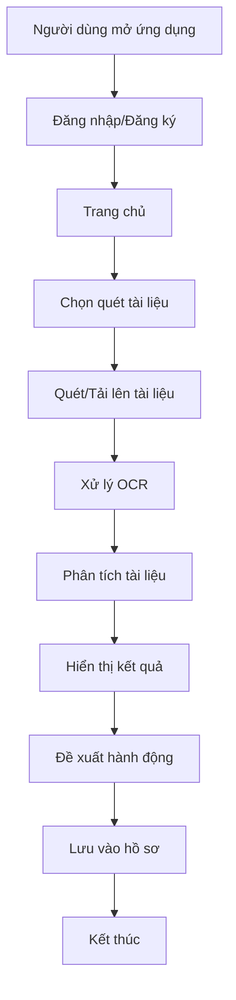
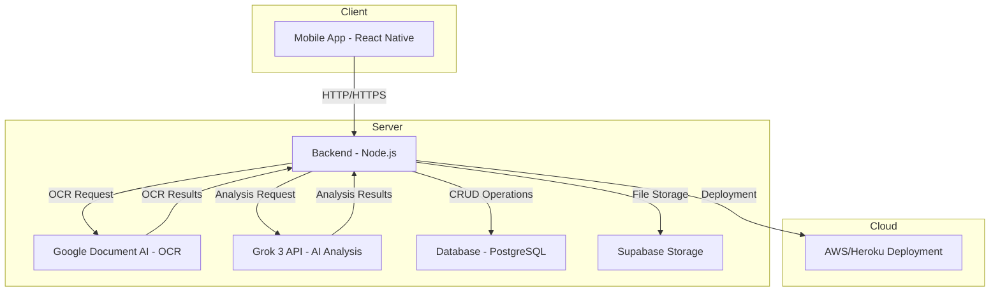

# Yêu Cầu Chi Tiết - Ứng Dụng Quét Tài Liệu Xin Visa

## 1. Danh Sách Tính Năng

### 1.1 Quét Tài Liệu
- Hỗ trợ quét tài liệu từ camera thiết bị di động
- Cho phép tải lên file ảnh từ thư viện
- Hỗ trợ nhiều định dạng ảnh (JPG, PNG, PDF)
- Tự động căn chỉnh và cắt ảnh
- Chất lượng quét tối thiểu 300 DPI

### 1.2 Trích Xuất Văn Bản (OCR)
- Sử dụng công nghệ OCR tiên tiến
- Hỗ trợ đa ngôn ngữ (tiếng Việt, tiếng Anh)
- Tự động nhận diện và trích xuất thông tin quan trọng
- Độ chính xác cao (>95%)
- Xử lý được cả văn bản in và viết tay

### 1.3 Phân Tích Hồ Sơ Visa
- Tự động phân loại loại tài liệu
- Kiểm tra tính hợp lệ của tài liệu
- Phát hiện các lỗi và thiếu sót
- Đề xuất các bước tiếp theo
- Tạo báo cáo phân tích chi tiết

### 1.4 Lưu Trữ Dữ Liệu
- Lưu trữ trên thiết bị đảm bảo an toàn thông tin khách hàng
- Tổ chức tài liệu theo hồ sơ, theo từng folder
- Hỗ trợ tìm kiếm và lọc
- Sao lưu tự động
- Quản lý phiên bản tài liệu

### 1.5 Xác Thực Người Dùng
- Đăng ký và đăng nhập tài khoản, hỗ trợ đăng nhập bằng gmail, facebook, icloud
- Quản lý phiên đăng nhập
- Phân quyền người dùng
- Khôi phục mật khẩu

## 2. Yêu Cầu Bảo Mật

### 2.1 Mã Hóa Dữ Liệu
- Mã hóa end-to-end cho tài liệu
- Mã hóa dữ liệu khi lưu trữ
- Sử dụng SSL/TLS cho kết nối
- Mã hóa mật khẩu với bcrypt
- Bảo vệ dữ liệu nhạy cảm

### 2.2 JWT (JSON Web Tokens)
- Sử dụng JWT cho xác thực
- Token có thời hạn
- Refresh token mechanism
- Blacklist cho token đã hủy
- Bảo mật token với signature

### 2.3 Tuân Thủ GDPR
- Quyền truy cập dữ liệu
- Quyền xóa dữ liệu
- Quyền xuất dữ liệu
- Thông báo vi phạm dữ liệu
- Chính sách bảo mật rõ ràng

## 3. Các Loại Tài Liệu Visa Hỗ Trợ

### 3.1 Hộ Chiếu
- Thông tin cá nhân
- Ảnh chân dung
- Dấu xuất nhập cảnh
- Thị thực hiện tại
- Trang bổ sung

### 3.2 Giấy Tờ Tùy Thân
- Chứng minh nhân dân
- Thẻ căn cước
- Giấy khai sinh
- Sổ hộ khẩu
- Giấy tờ liên quan

### 3.3 Đơn Xin Visa
- Form đăng ký visa
- Giấy tờ chứng minh tài chính
- Giấy tờ công việc
- Lịch trình du lịch
- Bảo hiểm du lịch

## 4. Sơ Đồ Luồng Người Dùng



## 5. Yêu Cầu Kỹ Thuật

### 5.1 Frontend
- React Native cho ứng dụng di động
- Material Design UI
- Responsive design
- Offline mode
- Push notifications

### 5.2 Backend
- Node.js với Express
- MongoDB cho database
- Redis cho cache
- AWS S3 cho lưu trữ
- Docker containerization

### 5.3 API
- RESTful API design
- API versioning
- Rate limiting
- Request validation
- Error handling

### 5.4 Testing
- Unit testing
- Integration testing
- Security testing
- Performance testing
- User acceptance testing 

## 6. Kiến Trúc Hệ Thống

### 6.1 Sơ Đồ Kiến Trúc



### 6.2 Luồng Dữ Liệu

1. **Upload Flow**:
   - Client → Backend: Gửi file tài liệu
   - Backend → Supabase: Lưu file
   - Backend → Database: Lưu metadata

2. **Analysis Flow**:
   - Backend → Google Document AI: Gửi file để OCR
   - Google Document AI → Backend: Trả về text đã trích xuất
   - Backend → Grok 3 API: Gửi text để phân tích
   - Grok 3 API → Backend: Trả về kết quả phân tích
   - Backend → Database: Lưu kết quả phân tích

3. **Result Flow**:
   - Client → Backend: Yêu cầu kết quả
   - Backend → Database: Truy xuất kết quả
   - Backend → Client: Trả về kết quả

### 6.3 API Endpoints

#### 6.3.1 Upload API
```typescript
POST /api/v1/upload
Request:
{
    file: File,
    documentType: string,
    userId: string
}

Response:
{
    success: boolean,
    fileId: string,
    uploadStatus: string,
    message: string
}
```

#### 6.3.2 Analyze API
```typescript
POST /api/v1/analyze
Request:
{
    fileId: string,
    userId: string,
    analysisType: string
}

Response:
{
    success: boolean,
    analysisId: string,
    status: string,
    estimatedTime: number
}
```

#### 6.3.3 Get Result API
```typescript
GET /api/v1/getResult
Request:
{
    analysisId: string,
    userId: string
}

Response:
{
    success: boolean,
    result: {
        documentType: string,
        confidence: number,
        extractedData: object,
        analysis: object,
        recommendations: array
    },
    status: string
}
```

### 6.4 Công Nghệ Sử Dụng

#### 6.4.1 Frontend
- React Native
- Redux cho state management
- Axios cho API calls
- React Navigation cho routing
- Native Base cho UI components

#### 6.4.2 Backend
- Node.js với Express
- TypeScript
- JWT cho authentication
- Socket.IO cho real-time updates
- Bull cho job queue

#### 6.4.3 Database
- PostgreSQL cho structured data
- Redis cho caching
- Supabase cho file storage
- Prisma cho ORM

#### 6.4.4 AI/ML Services
- Google Document AI cho OCR
- Grok 3 API cho phân tích
- TensorFlow.js cho xử lý local

#### 6.4.5 Infrastructure
- AWS/Heroku cho hosting
- Docker cho containerization
- GitHub Actions cho CI/CD
- Cloudflare cho CDN 

// Tạo frame chính cho dự án
create_frame({
  name: "VisaEase Wireframe",
  width: 375,  // Kích thước iPhone 12
  height: 812,
  backgroundColor: "#F2F2F7"  // Màu nền xám nhạt
})

// Tạo style guide cho màu sắc
create_frame({
  name: "Color Guide",
  x: 400,
  y: 0,
  width: 200,
  height: 300,
  backgroundColor: "#FFFFFF"
})

// Tạo các màu chính
create_rectangle({
  name: "Primary Blue",
  x: 420,
  y: 20,
  width: 100,
  height: 100,
  backgroundColor: "#007AFF"
})

create_rectangle({
  name: "Success Green",
  x: 420,
  y: 140,
  width: 100,
  height: 100,
  backgroundColor: "#34C759"
})

// Tạo nút "Quét tài liệu"
create_rectangle({
  name: "Scan Button",
  x: 87.5,  // (375 - 200) / 2
  y: 376,   // (812 - 60) / 2
  width: 200,
  height: 60,
  backgroundColor: "#007AFF",
  cornerRadius: 12
})

// Tạo text cho nút
create_text({
  text: "Quét tài liệu",
  x: 137.5,  // 87.5 + (200 - 125) / 2
  y: 396,    // 376 + (60 - 20) / 2
  fontSize: 18,
  fontFamily: "SF Pro",
  color: "#FFFFFF",
  textAlign: "center"
})

// Tạo bottom navigation
create_rectangle({
  name: "Bottom Nav",
  x: 0,
  y: 764,  // 812 - 48
  width: 375,
  height: 48,
  backgroundColor: "#FFFFFF"
})

// Tạo các tab
const tabs = [
  { name: "Trang chủ", x: 0 },
  { name: "Quét", x: 75 },
  { name: "Kết quả", x: 150 },
  { name: "Tin tức", x: 225 },
  { name: "Hồ sơ", x: 300 }
]

tabs.forEach(tab => {
  create_text({
    text: tab.name,
    x: tab.x + 20,
    y: 780,
    fontSize: 12,
    fontFamily: "SF Pro",
    color: "#007AFF"
  })
})

// Tạo frame cho màn hình quét
create_frame({
  name: "Scanning Screen",
  x: 400,
  y: 0,
  width: 375,
  height: 812,
  backgroundColor: "#F2F2F7"
})

// Tạo text hướng dẫn
create_text({
  text: "Căn chỉnh tài liệu trong khung hình",
  x: 37.5,  // (375 - 300) / 2
  y: 100,
  fontSize: 16,
  fontFamily: "SF Pro",
  color: "#000000",
  textAlign: "center"
})

// Tạo khung camera
create_rectangle({
  name: "Camera Frame",
  x: 37.5,  // (375 - 300) / 2
  y: 140,
  width: 300,
  height: 400,
  backgroundColor: "#FFFFFF",
  strokeColor: "#007AFF",
  strokeWeight: 2,
  dashPattern: [5, 5]
})

// Thêm header cho màn hình quét
create_rectangle({
  name: "Header",
  x: 400,
  y: 0,
  width: 375,
  height: 44,
  backgroundColor: "#FFFFFF"
})

create_text({
  text: "Quét tài liệu",
  x: 400,
  y: 12,
  fontSize: 17,
  fontFamily: "SF Pro",
  color: "#000000",
  textAlign: "center"
})

// Thêm nút đóng camera
create_rectangle({
  name: "Close Button",
  x: 700,  // 400 + 375 - 44
  y: 0,
  width: 44,
  height: 44,
  backgroundColor: "#FFFFFF"
})

// Tạo các kết nối giữa các màn hình
create_frame({
  name: "User Flow",
  x: 800,
  y: 0,
  width: 300,
  height: 400,
  backgroundColor: "#FFFFFF"
})

// Thêm các mũi tên chỉ hướng
create_rectangle({
  name: "Flow Arrow 1",
  x: 850,
  y: 100,
  width: 200,
  height: 2,
  backgroundColor: "#007AFF"
})

// Lưu dự án
execute_figma_code(`
  figma.root.name = "VisaEase Wireframe";
  figma.save();
`)

// Xuất các frame chính
export_node_as_image({
  nodeId: "Home Screen",
  format: "PNG",
  scale: 2
})

export_node_as_image({
  nodeId: "Scanning Screen",
  format: "PNG",
  scale: 2
})

# Thiết lập biến môi trường
$env:ANDROID_HOME = "D:\Android\SDK"

# Thêm vào PATH
$env:PATH += ";$env:ANDROID_HOME\platform-tools"
$env:PATH += ";$env:ANDROID_HOME\tools"
$env:PATH += ";$env:ANDROID_HOME\tools\bin"
$env:PATH += ";$env:ANDROID_HOME\emulator"

cd visa-scanner-app
npm start